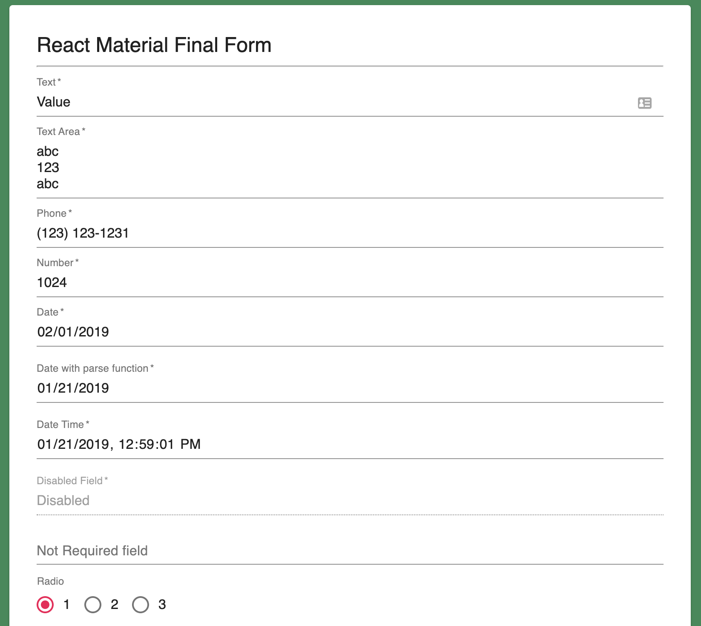

# react-material-final-form

[](https://badge.fury.io/js/react-material-final-form)

Easy & Simple form with Material UI and Final Form.

[Demo](http://react-material-final-form.s3-website-us-east-1.amazonaws.com/)



## GetStarted

```bash
npm i --save react-material-final-form
```

```javascript
import React, { Fragment } from 'react';
import DetailForm from 'react-material-final-form';

const title = 'My form';
const metadata = {
  fields: [{
    key: 'text',
    type: 'String',
    label: 'Text',
  }, {
    key: 'defaultValue',
    type: 'String',
    label: 'Default Value',
  }, {
    key: 'number',
    type: 'Number',
    label: 'Number',
  }, {
    key: 'disabledField',
    type: 'String',
    label: 'Disabled Field',
    isDisabled: true,
  }]
};

const data = {
  defaultValue: 'Value'
};

function App() {
  return (
    <Fragment>
      <h1>React Material Final Form</h1>
      <DetailForm 
        title={title}
        metadata={metadata}
        data={data}
        debug={true}
        onSubmit={console.log}
      />
    </Fragment>
  )
}

export default App;
```

## Dependencies

```json
"dependencies": {
    "@material-ui/core": "^4.4.3",
    "final-form": "^4.18.5",
    "final-form-arrays": "^3.0.1",
    "final-form-material-ui": "^0.3.0",
    "final-form-set-field-data": "^1.0.2",
    "object-diff": "0.0.4",
    "react": "^16.9.0",
    "react-dom": "^16.9.0",
    "react-dropzone": "^10.1.9",
    "react-final-form": "^6.3.0",
    "react-final-form-arrays": "^3.1.1"
}
```

## Fields

### Text

```javascript
{
    key: 'text',
    type: 'string',
    label: 'Text',
}
```

### Textarea

```javascript
{
    key: 'textarea',
    type: 'string',
    label: 'Text Area',
    formType: 'textarea',
}
```

### Text (US Phone)

```javascript
{
    key: 'phone',
    type: 'string',
    label: 'Phone',
    formType: 'phone',
}
```

### Number

```javascript
{
    key: 'number',
    type: 'number',
    label: 'Number',
}
```

### Date

```javascript
{
    key: 'date',
    type: 'string',
    label: 'Date',
    formType: 'date',
}
```

### Date Time

```javascript
{
    key: 'dateWithParseFunction',
    type: 'string',
    label: 'Date with parse function',
    formType: 'date',
    formFormatFunction(value) {
      return moment(value).format('YYYY-MM-DD');
    },
    formParseFunction(value) {
      return moment(value).toISOString();
    }
}
```

### Radio

```javascript
{
    key: 'radio',
    type: 'number',
    label: 'Radio',
    formType: 'Radio',
    formOptions: [
      { label: '1', value: 1 },
      { label: '2', value: 2 },
      { label: '3', value: 3 },
    ],
}
```

### Checkbox

```javascript
{
    key: 'checkbox',
    type: 'Array',
    label: 'Checkbox',
    formType: 'Checkbox',
    formOptions: [
      { label: 'English', value: 'English' },
      { label: 'Mandarin', value: 'Mandarin' },
      { label: 'Spanish', value: 'Spanish' },
      { label: 'Cantonese', value: 'Cantonese' },
      { label: 'Vietnamese', value: 'Vietnamese' },
      { label: 'Tagalog', value: 'Tagalog' },
      { label: 'Malay', value: 'Malay' },
      { label: 'Korean', value: 'Korean' },
      { label: 'Japanese', value: 'Japanese' },
      { label: 'French', value: 'French' },
      { label: 'German', value: 'German' },
    ],
  }
```

### Array Items

```javascript
{
    key: 'profile.address',
    type: 'Array',
    label: 'Address',
    formType: 'InputArray',
    formInputArrayObject: [{
      key: 'street',
      label: 'Street',
    }, {
      key: 'city',
      label: 'City',
    }, {
      key: 'state',
      label: 'State',
    }, {
      key: 'zipCode',
      label: 'Zip Code',
    }]
}
```

### Object Item

```javascript
{
    key: 'selectObject',
    type: 'Object',
    label: 'Select Object',
    formType: 'Object',
    formObjects: [{
      key: 'prop1',
      type: 'Number',
      label: 'Prop 1',
      formType: 'Select',
      formOptions: [
        { label: '1', value: 1 },
        { label: '2', value: 2 },
        { label: '3', value: 3 },
      ]
    }, {
      key: 'prop2',
      type: 'Number',
      label: 'Prop 2',
      formType: 'Radio',
      formOptions: [
        { label: 'a', value: 'a' },
        { label: 'b', value: 'b' },
        { label: 'c', value: 'c' },
      ],
    }],
  }
```

### Disabled

```javascript
{
    key: 'disabledField',
    type: 'string',
    label: 'Disabled Field',
    isDisabled: true,
}
```

### Not Required

```javascript
{
    key: 'notRequired',
    type: 'string',
    label: 'Not Required field',
    isRequired: false,
}
```
